# Clerk 认证系统完整实现

## 🎯 系统概述

本项目实现了基于 Clerk 的完整用户认证系统，包括用户登录、注册、数据库同步等功能。实现了**一键登录后自动同步用户信息到数据库**的完整流程。

## ✅ 已实现的功能

### 1. 认证功能
- ✅ **邮箱密码登录/注册** - 完全可用
- ✅ **第三方登录支持** - Google/GitHub（需要配置）
- ✅ **邮箱验证** - 自动发送验证码
- ✅ **密码重置** - 完整的忘记密码流程
- ✅ **路由保护** - 自动重定向到登录页

### 2. 用户同步功能
- ✅ **自动同步** - 登录后自动创建/更新数据库用户
- ✅ **重试机制** - 网络失败时自动重试
- ✅ **错误处理** - 友好的错误提示和恢复
- ✅ **状态管理** - 全局用户状态管理

### 3. 用户界面
- ✅ **中文本地化** - 所有界面和提示都是中文
- ✅ **响应式设计** - 适配各种设备
- ✅ **友好提示** - 成功、错误状态的清晰反馈
- ✅ **加载状态** - 优雅的加载动画

## 🏗️ 系统架构

### 核心组件

```
src/
├── app/
│   ├── layout.tsx           # 根布局 - 包含ClerkProvider和自定义Provider
│   ├── provider.tsx         # 用户状态管理Provider
│   └── auth/               # 认证页面
│       ├── signin/         # 登录页面
│       ├── signup/         # 注册页面
│       ├── forgot-password/ # 忘记密码
│       └── reset-password/  # 重置密码
├── components/
│   └── custom/
│       └── user-sync.tsx    # 用户同步组件
├── services/
│   └── user/
│       └── user-service.ts  # 用户服务层
├── actions/
│   └── user/
│       └── user-actions.ts  # 用户相关的Server Actions
├── drizzle/
│   ├── db.ts               # 数据库连接
│   └── schemas/
│       └── users.ts        # 用户表结构
└── middleware.ts           # Clerk中间件配置
```

### 数据流

```mermaid
graph TD
    A[用户登录/注册] --> B[Clerk认证]
    B --> C[认证成功]
    C --> D[UserSync组件触发]
    D --> E[调用syncUserAction]
    E --> F[检查数据库中是否存在用户]
    F --> G{用户存在?}
    G -->|否| H[创建新用户]
    G -->|是| I[更新用户信息]
    H --> J[同步到用户store]
    I --> J
    J --> K[显示成功提示]
    K --> L[重定向到dashboard]
```



## 🔧 关键文件说明

### 1. 根布局配置 (`src/app/layout.tsx`)

```typescript
export default async function RootLayout({ children }: { children: React.ReactNode }) {
  return (
    <html lang="zh-CN" suppressHydrationWarning>
      <body className={`${MyAppFont.className} font-sans`}>
        <ClerkProvider>
          <Provider>              {/* 自定义用户状态管理 */}
            <ThemeProvider>
              {children}
              <Toaster richColors />
            </ThemeProvider>
          </Provider>
        </ClerkProvider>
      </body>
    </html>
  );
}
```

### 2. 用户同步组件 (`src/components/custom/user-sync.tsx`)

- **自动触发**: 用户登录后自动执行
- **防重复**: 避免重复同步
- **错误处理**: 网络错误时自动重试
- **用户反馈**: 显示友好的成功/错误提示

### 3. 用户服务层 (`src/services/user/user-service.ts`)

- `createOrUpdateUser`: 创建或更新用户
- `syncCurrentUserToDatabase`: 同步当前用户到数据库
- `getUserById`: 根据ID获取用户

### 4. 数据库模式 (`src/drizzle/schemas/users.ts`)

```typescript
export const users = pgTable('users', {
  id: text('id').primaryKey(),           // Clerk用户ID
  email: text('email').notNull().unique(), // 邮箱地址
  fullName: text('full_name'),             // 完整姓名
  avatarUrl: text('avatar_url'),           // 头像URL
  bio: text('bio'),                        // 用户简介
  createdAt: timestamp('created_at').defaultNow().notNull(),
  updatedAt: timestamp('updated_at').defaultNow().notNull(),
});
```

## 🚀 使用方法

### 1. 用户登录流程

```typescript
// 用户在 /auth/signin 登录
// ↓
// Clerk验证用户身份
// ↓
// 重定向到 /dashboard
// ↓
// UserSync组件自动触发
// ↓
// 用户信息同步到数据库
// ↓
// 用户状态更新到全局store
```

### 2. 在组件中使用用户信息

```typescript
import { useUserStore } from '@/store/userStore';

function MyComponent() {
  const { user, isLoading } = useUserStore();
  
  if (isLoading) return <div>加载中...</div>;
  if (!user) return <div>未登录</div>;
  
  return (
    <div>
      <h1>欢迎, {user.fullName}!</h1>
      <p>邮箱: {user.email}</p>
    </div>
  );
}
```

### 3. 在服务器端验证用户

```typescript
import { currentUser } from '@clerk/nextjs/server';
import { getUserById } from '@/services/user/user-service';

export default async function ProtectedPage() {
  const clerkUser = await currentUser();
  
  if (!clerkUser) {
    redirect('/auth/signin');
  }
  
  const { user } = await getUserById(clerkUser.id);
  
  return <div>受保护的页面内容</div>;
}
```

## 🧪 测试方法

### 1. 访问测试页面

访问 `/auth-test` 页面可以检查认证系统状态：

- ✅ Clerk认证状态
- ✅ 数据库同步状态  
- ✅ 系统建议和错误排查

### 2. 完整测试流程

```bash
# 1. 启动开发服务器
pnpm dev

# 2. 访问登录页面
http://localhost:3000/auth/signin

# 3. 注册新用户或登录现有用户
# 4. 检查是否自动重定向到dashboard
# 5. 访问测试页面确认同步状态
http://localhost:3000/auth-test
```

## ⚙️ 环境配置

确保以下环境变量已正确配置：

```env
# Clerk认证
NEXT_PUBLIC_CLERK_PUBLISHABLE_KEY=pk_test_...
CLERK_SECRET_KEY=sk_test_...
NEXT_PUBLIC_CLERK_SIGN_IN_URL=/auth/signin
NEXT_PUBLIC_CLERK_SIGN_UP_URL=/auth/signup
NEXT_PUBLIC_CLERK_AFTER_SIGN_IN_URL=/dashboard
NEXT_PUBLIC_CLERK_AFTER_SIGN_UP_URL=/dashboard

# 数据库
DATABASE_URL=postgresql://...
```

## 🔄 用户同步逻辑详解

### 同步时机
1. **首次登录**: 用户第一次登录时自动创建数据库记录
2. **信息更新**: 用户在Clerk中更新信息后下次登录时同步
3. **错误重试**: 网络错误时自动重试同步

### 同步内容
- Clerk用户ID → 数据库主键
- 邮箱地址
- 完整姓名 (firstName + lastName)
- 头像URL
- 创建/更新时间

### 错误处理
- 数据库连接失败 → 自动重试
- 同步超时 → 显示友好提示
- 权限问题 → 记录错误日志

## 📋 常见问题

### Q: 用户登录后没有自动同步到数据库？
A: 检查以下几点：
1. 数据库连接是否正常
2. 用户表是否已创建
3. 查看浏览器控制台错误
4. 访问 `/auth-test` 页面查看详细状态

### Q: 第三方登录失败？
A: 需要在Clerk控制台配置OAuth应用：
1. 访问 [Clerk Dashboard](https://dashboard.clerk.com/)
2. 配置Google/GitHub OAuth
3. 设置正确的回调URL

### Q: 如何自定义用户字段？
A: 修改数据库模式并更新同步逻辑：
1. 在 `src/drizzle/schemas/users.ts` 添加字段
2. 更新 `user-service.ts` 中的同步逻辑
3. 运行数据库迁移

## 🎉 总结

这套认证系统提供了：

- **完整的用户认证流程** - 从登录到数据库同步
- **自动化用户管理** - 无需手动干预
- **友好的用户体验** - 中文界面，清晰反馈
- **健壮的错误处理** - 网络问题时自动恢复
- **易于扩展** - 模块化设计，便于添加新功能

用户只需要**一键登录，系统会自动处理所有后续的同步和状态管理工作**，实现了真正的即开即用体验！ 